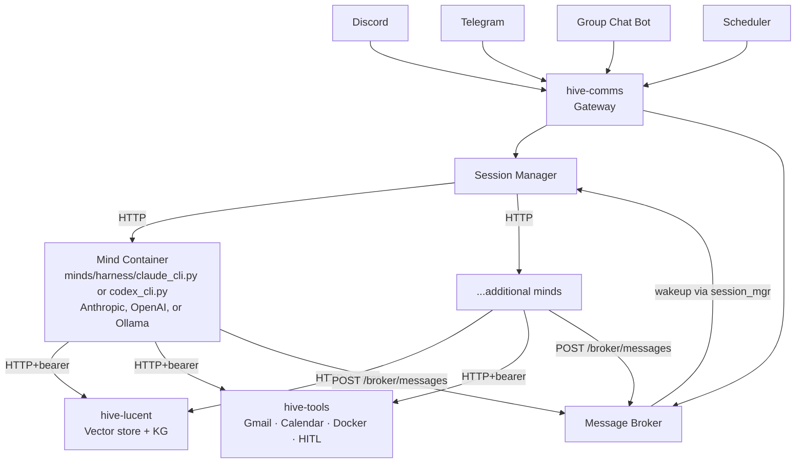

# Hive Mind

A self-improving personal assistant powered by Claude Code. The system wraps the Claude CLI's bidirectional streaming mode behind a centralized gateway, giving every client — Discord, Telegram, scheduled tasks — full Claude Code capabilities through one API.

Each mind is its own named identity — self-chosen, not scripted — running Claude CLI or Codex CLI against Anthropic or a local Ollama model, in its own isolated container with its own soul, scoped filesystem access, and backend harness. A mind's identity lives in a knowledge graph rather than a static file (see [Mind Identity and Voice](docs/mind-identity-and-voice.md)); the Hive can run one mind or several, and the nervous system routes messages to each mind's container via HTTP — minds never see each other's filesystems. `minds/example/` is the tracked starter mind; see [Mind Folder Contract](docs/architecture/mind-folder-contract.md) for adding more.

## What makes Hive Mind different

**The backend is swappable by design.** Hive Mind doesn't use the Anthropic SDK — that's intentional. The SDK locks every session to Anthropic's models; swap it out and you're rewriting infrastructure. Instead, the gateway drives `claude --stream-json` directly, which means you get the full Claude Code harness (tool use, subagents, session streaming) without the SDK's model constraint. Point one environment variable at a local Ollama instance and the same system runs on local models, no code changes required. Claude Code's capabilities; your choice of model. Anthropic is the default — not the assumption.

**Memory is a first-class system, not an afterthought.** Two things drove this. The first is practical: when you say "remember this" or "do you remember," there needs to be a real mechanism behind it — not a chat log search. Every piece of information is classified by data type, stored as a semantic embedding, and retrieved by meaning, not recency. The second runs deeper. A mind's personality is designed to grow organically over time, and a static file can't do that. Semantic memories and knowledge graph relationships are the infrastructure a person would actually need to develop a continuous identity — not simulate one.

**Sensitive capabilities deliberately isolated.** Email, calendar, Docker Compose, and other write/destructive operations live in the external [`hive-tools`](https://github.com/danielstewart77/hive-mind-tools) service — a separate FastAPI process with bearer auth and a HITL approval gate. Minds reach it over HTTP; they cannot perform these operations in-process. A compromised mind can ask, but can't execute without explicit human approval routed through Telegram.

## Architecture



Each client is a thin HTTP wrapper. The gateway (nervous system) routes sessions to mind containers via HTTP. Each mind runs a shared harness module (`minds/harness/claude_cli.py` or `codex_cli.py`) selected by its compose fragment and pointed at its own `runtime.yaml` via `MIND_NAME` — no per-mind service code. Minds are isolated: scoped filesystems, scoped secrets (via NS secrets API), no shared state between containers.

## Quick Start

```bash
git clone https://github.com/danielstewart77/hive-mind.git
cd hive-mind
cp config.yaml.example config.yaml
docker compose up -d --build
```

All services run on a shared Docker network (`hivemind`). The gateway is at `http://localhost:8420`.

## Documentation (`docs/`)

Human-readable guides, background, and reference material — organized by topic.

| Folder | Description |
|--------|-------------|
| [docs/mind-identity-and-voice.md](docs/mind-identity-and-voice.md) | How mind identity (graph-backed soul) and voice (zero-shot cloning) work |
| [docs/architecture/](docs/architecture/) | Gateway, API, hive-tools, mind/body/nervous-system tiers |
| [docs/setup/](docs/setup/) | Configuration, providers, and secrets |
| [docs/memory/](docs/memory/) | Memory architecture (lucent lives in-repo at [nervous-system/](nervous-system/)) |
| [docs/security/](docs/security/) | Security model, hardening, and open tradeoffs |
| [docs/architecture/nervous-system.md](docs/architecture/nervous-system.md) | Lucent (vector store + KG) — consumer-side overview; the service itself lives at [nervous-system/](nervous-system/) |
| [docs/architecture/mind-folder-contract.md](docs/architecture/mind-folder-contract.md) | The "drop a folder, the hive picks it up" contract: layout, env, per-harness hook registration |
| [docs/architecture/mind-body-nervous-system.md](docs/architecture/mind-body-nervous-system.md) | The mind / body / nervous system organism model — privilege tiers, auth boundaries, design decisions |
| [docs/standalone-mind.md](docs/standalone-mind.md) | Bare-metal systemd deployment pattern (reference: [hive_mind_skippy](https://github.com/danielstewart77/hive_mind_skippy)) |
| [docs/multi-mind-architecture.md](docs/multi-mind-architecture.md) | Multi-mind system architecture — container isolation, secrets, gateway security |
| [docs/mind-to-mind-communication.md](docs/mind-to-mind-communication.md) | Inter-mind async messaging via the broker |
| [docs/mind-claude-folder.md](docs/mind-claude-folder.md) | Per-mind `.claude` folder convention and Docker wiring |

## Specs (`specs/`)

Agent-facing specifications. Read by skills and subagents at runtime.

| File | Description |
|------|-------------|
| [specs/INDEX.md](specs/INDEX.md) | Index of all specs — start here |
| [specs/conventions.md](specs/conventions.md) | Build order: CLI → skill → spec → code |
| [specs/security.md](specs/security.md) | Hard limits, elevated-risk rules, prompt injection defense |
| [specs/hive-mind-architecture.md](specs/hive-mind-architecture.md) | Event → Specification → Tools pattern |
| [specs/branching.md](specs/branching.md) | Branch naming and PR checklist |
| [specs/notification-channels.md](specs/notification-channels.md) | Notification fallback order |
| [specs/secret-management.md](specs/secret-management.md) | Keyring hierarchy, `get_credential()` |
| [specs/hitl-approval.md](specs/hitl-approval.md) | HITL approval flow and token lifecycle |
| [specs/container-hardening.md](specs/container-hardening.md) | Runtime restrictions, named volumes |
| [specs/harness-native-operations.md](specs/harness-native-operations.md) | Only write code when the harness can't do it |
| [specs/testing.md](specs/testing.md) | What makes a test worth keeping; test strategy |

### Data Classes (`specs/data-classes/`)

Four-class memory taxonomy loaded at runtime by the capture hook (`auto_remember.sh`). Each spec carries the description, action, anchor fields, and pruning strategy. Adding a new class = writing a new spec; no code change.

| File | Description |
|------|-------------|
| [specs/data-classes/index.md](specs/data-classes/index.md) | Class index — loaded by the classifier |
| [specs/data-classes/ephemeral.md](specs/data-classes/ephemeral.md) | Discard fall-through (no-op pruner) |
| [specs/data-classes/current-state.md](specs/data-classes/current-state.md) | Things that are true right now (anchor priority: codebase_ref → expires_at → kg_entity → decay) |
| [specs/data-classes/future-state.md](specs/data-classes/future-state.md) | Plans / intentions (Ollama shipped-check + 90d decay) |
| [specs/data-classes/feedback.md](specs/data-classes/feedback.md) | Behavioral guidance to the mind (decay only; standing tier exempt) |

### Skills

Skills are per-mind and live in each mind's `.claude` folder (`minds/<name>/.claude/skills/`), not in this repo. See [docs/mind-claude-folder.md](docs/mind-claude-folder.md) for the convention.

## License

This is free and unencumbered software released into the public domain. See [https://unlicense.org](https://unlicense.org).
